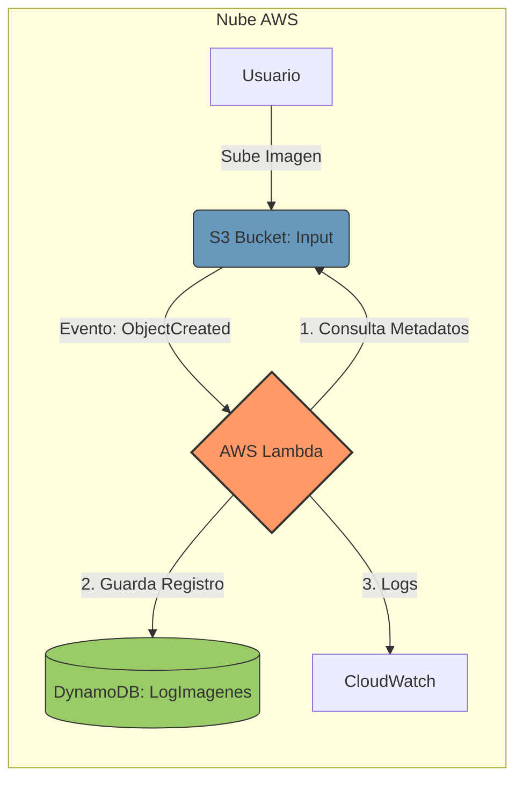

# 🚀 Serverless Image Metadata Extractor (AWS + Terraform)

Este proyecto automatiza la extracción de metadatos de imágenes subidas a Amazon S3, procesándolas con AWS Lambda y almacenando los resultados en una tabla de DynamoDB.

## 🏗️ Arquitectura
- **Amazon S3**: Almacenamiento de entrada (Input) y salida (Output).
- **AWS Lambda**: Función en Python 3.9 que se activa por eventos de S3.
- **Amazon DynamoDB**: Base de datos NoSQL que almacena los metadatos (ID, Tamaño, Formato, Fecha).
- **Terraform**: Herramienta de IaC para desplegar toda la infraestructura.

### 📊 Diagrama de Arquitectura

## 🛠️ Tecnologías utilizadas
- **Cloud**: AWS (S3, Lambda, DynamoDB, IAM, CloudWatch).
- **IaC**: Terraform.
- **Lenguaje**: Python 3.9 (Boto3 SDK).

## 🚀 Cómo desplegar
1. Clonar el repositorio.
2. Comprimir el código de la lambda: `zip index.zip index.py`.
3. Ejecutar `terraform init`.
4. Ejecutar `terraform apply -auto-approve`.

## 📈 Aprendizajes clave
- Gestión de permisos IAM mediante roles y políticas.
- Configuración de disparadores (triggers) asíncronos en S3.
- Uso de la API `head_object` de Boto3 para optimizar costes y rendimiento.
